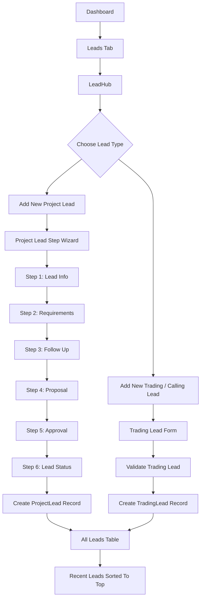
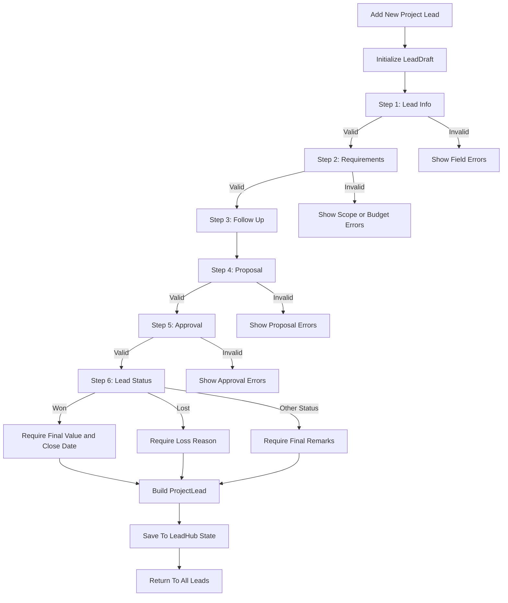
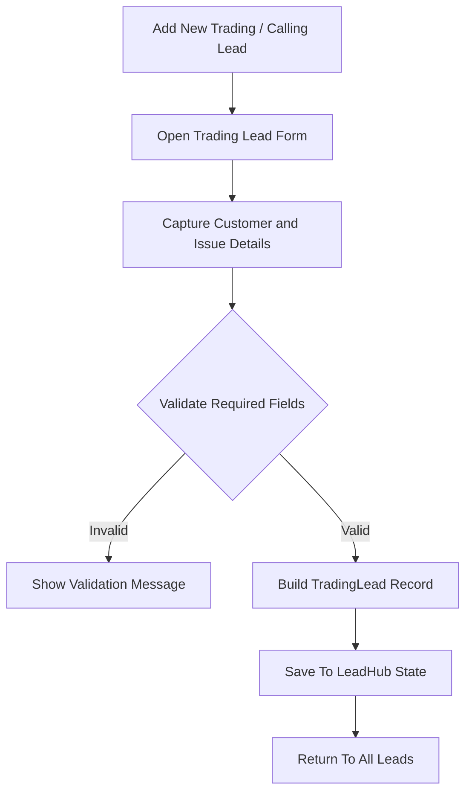
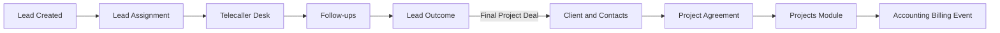

# Lead Module Flow

Last updated: 2026-07-06

## 1. Purpose

The Lead module is the entry point for creating and reviewing CRM leads. It supports two lead creation paths:

- Project Lead: software, web app, CRM, ERP, mobile app, website, or service-based project enquiry.
- Trading / Calling Lead: account opening, trading app issue, website issue, payment issue, general query, or investment interest.

The Lead module is rendered from:

- `src/components/dashboard/leads/LeadHub.tsx`

Dashboard route:

- `/dashboard`
- Active tab: `leads`

## 2. High-Level Flow Diagram

## 3. LeadHub Responsibilities

File:

- `src/components/dashboard/leads/LeadHub.tsx`

State owned by `LeadHub`:

- `mode`: controls whether the user sees home, project lead wizard, or trading lead form.
- `projectCreated`: project lead list.
- `tradingCreated`: trading lead list.
- `recentLeadIds`: tracks newly created leads so they appear at the top.

LeadHub options:

- Add New Project Lead.
- Add New Trading / Calling Lead.
- All Leads table.

All Leads table columns:

- Lead ID.
- Type.
- Name.
- Mobile.
- Source.
- Assigned.
- Status.
- Detail.

## 4. Project Lead Flow

Component:

- `src/components/dashboard/leads/ProjectLeadStepWizard.tsx`

Project lead state:

- Uses `LeadDraft`.
- Forces `department` to `Projects`.
- Starts with default project values:
  - `status`: `New Enquiry`
  - `projectType`: `New Project`
  - `serviceRequired`: `Web App`
  - `platformRequired`: `Web`

Step navigation:

- Users can go back to completed/unlocked steps.
- Future steps are locked until the current step is saved.
- `maxUnlockedStep` prevents validation bypass.

### Project Lead Diagram

## 5. Project Lead Step Details

### Step 1: Lead Info

File:

- `src/components/dashboard/leads/Step1LeadInfo.tsx`

Purpose:

- Capture lead identity, source, contact details, owner, and location.

Required fields:

- Lead date.
- Department.
- Lead source.
- First name.
- Mobile number.
- Assigned to.
- City.
- State.
- Country.

Conditional required field:

- Source detail is required when lead source is `Other Social Media`.

Validation:

- First name minimum 2 characters.
- Personal email must be valid if entered.
- Official email must be valid if entered.
- Mobile must be 10 digits.
- Alternate mobile must be 10 digits if entered.

Output saved to:

- `LeadDraft`

### Step 2: Requirements

File:

- `src/components/dashboard/leads/Step2Requirements.tsx`

Purpose:

- Capture project/service scope, platform, timeline, project description, technology preference, reference link, budget, currency, and payment mode.

Required fields:

- Service required.
- Project type.
- Platform.
- Target timeline.
- Project description.
- Payment mode.

Validation:

- Project description must include at least 20 characters.
- Reference link must be a valid URL if entered.
- Budget values must be greater than 0 when entered.
- Max budget must be greater than or equal to min budget.

Output saved to:

- `LeadDraft`

### Step 3: Follow Up

File:

- `src/components/dashboard/leads/Step3FollowUp.tsx`

Purpose:

- Track communication records and preserve follow-up context before proposal creation.

Follow-up fields:

- Date.
- Time.
- Mode.
- Client response.
- Next follow-up date.
- Conversation summary.

Required fields when adding a record:

- Date.
- Conversation summary.

State behavior:

- New follow-up records are added to local follow-up history.
- Latest summary is saved into `remarks`.
- Next follow-up date or current follow-up date is saved into `followUpDate`.
- Response can update lead status:
  - `Interested` sets status to `Interested`.
  - `Not Interested` sets status to `Lost`.

### Step 4: Proposal

File:

- `src/components/dashboard/leads/Step4Proposal.tsx`

Purpose:

- Capture commercial proposal data and allow frontend PDF file selection.

Required fields:

- Proposal number.
- Proposal date.
- Amount.

Validation:

- Amount must be greater than 0.

File behavior:

- PDF upload field stores selected file name in frontend state only.
- Real file storage requires backend document upload API.

### Step 5: Approval

File:

- `src/components/dashboard/leads/Step5Approval.tsx`

Purpose:

- Capture management review before final lead closure.

Required fields:

- Reviewer designation.
- Final decision.
- Review audit comments.

Validation:

- Comments must include at least 10 characters.
- Decision must be one of:
  - Approve.
  - Reject.
  - Need Revision.

### Step 6: Lead Status

File:

- `src/components/dashboard/leads/Step6LeadStatus.tsx`

Purpose:

- Finalize the lead outcome and create the final `ProjectLead` record.

Required fields:

- Final lead status.
- Priority level.
- Closure executive remarks.

Conditional required fields:

- If status is `Won`:
  - Final closed value is required.
  - Actual close date is required.
- If status is `Lost`:
  - Reason for loss is required.

Optional fields:

- Expected deal value.
- Competitor name.

Final statuses:

- Interested.
- Proposal Sent.
- Negotiation.
- Won.
- Lost.
- On Hold.

## 6. Project Lead Record Creation

When Step 6 completes, `ProjectLeadStepWizard` creates a `ProjectLead` object.

Important mapping:

| LeadDraft Field | ProjectLead Field |
| --- | --- |
| `leadId` | `id` with `LEAD` replaced by `PRJ` |
| `firstName` | `firstName` |
| `lastName` | `lastName` |
| `mobile` | `mobile` |
| `personalEmail` or `officialEmail` | `email` |
| `leadSource` and `sourceDetail` | `source` |
| `status` | normalized project status |
| `assignedTo` | `assignedTo` |
| `overallRemarks`, `remarks`, or `projectDescription` | `remarks` |
| `closeDate` or `leadDate` | `followUpDate` |
| `projectType` or `serviceRequired` | `projectType` |
| `projectDescription` | `requirementSummary` |
| final/expected/max/min/proposal amount | `budget` |
| `timeline` | `timeline` |
| `proposalDate` or `leadDate` | `meetingDate` |

Status normalization:

| Input Status | ProjectLead Status |
| --- | --- |
| Proposal Sent | Proposal Sent |
| Negotiation | Negotiation |
| Won | Won |
| Lost | Lost |
| On Hold | Requirement Discussed |
| Other | New Enquiry |

Proposal status normalization:

| Input Status | Proposal Status |
| --- | --- |
| Proposal Sent | Sent |
| Negotiation | Negotiation |
| Won | Won |
| Lost | Lost |
| Other | Pending |

Won lead handoff:

- `developmentStatus`: `Discovery`
- `developmentProgress`: `10`
- `developmentOwner`: `Development Team`

Other lead handoff:

- `developmentStatus`: `Not Started`
- `developmentProgress`: `0`
- `developmentOwner`: `Unassigned`

## 7. Trading / Calling Lead Flow

Component:

- `src/components/dashboard/leads/TradingLeadCreate.tsx`

Purpose:

- Capture faster telecaller/calling leads for account opening, app/site support, payments, general queries, and investment interest.

### Trading Lead Diagram

Trading form fields:

- First name.
- Last name.
- Mobile.
- Email.
- Source.
- Source detail.
- Assigned telecaller.
- Issue type.
- Account / app status.
- Customer availability.
- Call status.
- Trading interest.
- Investment budget.
- Experience.
- Risk appetite.
- KYC status.
- Demat status.
- Follow-up date.
- Call note.

Required fields:

- First name.
- Mobile.
- Trading interest.
- Follow-up date.
- Call note.

Conditional required field:

- Source detail is required when source is `Other Social Media`.

Validation:

- Mobile must be exactly 10 digits.
- Email must be valid if entered.
- Investment budget cannot be negative.
- Follow-up date is required.

Trading lead output:

- Creates a `TradingLead`.
- ID format is `TRD-####`.
- Assigned telecaller is resolved from `telecallers`.
- Call note is saved as `remarks` and `lastCallNote`.
- Budget is stored as a number.

## 8. Data Models

Source file:

- `src/components/dashboard/leads/leadTypes.ts`

Core models:

- `BaseLead`
- `TradingLead`
- `ProjectLead`
- `LeadDraft`
- `LeadRecord`
- `LeadAssignment`
- `TransferLog`

Shared base lead fields:

- `id`
- `firstName`
- `lastName`
- `mobile`
- `email`
- `source`
- `status`
- `assignedTo`
- `currentOwnerId`
- `teamLeaderId`
- `transferHistory`
- `remarks`
- `followUpDate`

Project-specific fields:

- `department`
- `projectType`
- `requirementSummary`
- `budget`
- `timeline`
- `proposalStatus`
- `quotationStatus`
- `meetingDate`
- `developmentStatus`
- `developmentProgress`
- `developmentOwner`

Trading-specific fields:

- `department`
- `interestLevel`
- `tradingInterest`
- `budget`
- `experienceLevel`
- `riskAppetite`
- `kycStatus`
- `dematStatus`
- `accountStatus`
- `issueType`
- `availability`
- `lastCallNote`

## 9. Lead Source Options

Current lead source options:

- Website.
- Google Ads.
- Referral.
- LinkedIn.
- Walk In.
- WhatsApp.
- Email.
- Facebook.
- Instagram.
- Other Social Media.

Important rule:

- `Other Social Media` requires a specific source detail.

## 10. Telecaller Data

Current telecaller options:

| ID | Employee ID | Name | Group |
| --- | --- | --- | --- |
| Tele-1 | EMP-2024-021 | Asha Verma | North Desk |
| Tele-2 | EMP-2024-022 | Neeraj Singh | North Desk |
| Tele-3 | EMP-2024-023 | Pooja Khan | North Desk |

## 11. Lead Module Connections

Dashboard connection:

- `src/app/dashboard/page.tsx`
- `activeTab === "leads"` renders `LeadHub`.

CRM sidebar connections related to lead lifecycle:

- `lead-assign`: assignment queue.
- `telecaller`: telecaller work desk.
- `followups`: follow-up management.
- `lead-outcomes`: final and not-final outcome tracking.
- `clients`: project client/contact linkage.
- `agreements`: project agreement handling.

Recommended production lifecycle:

## 12. Current Data Source

Current frontend data source:

- Seed data from `leadTypes.ts`.
- Local React state in `LeadHub`.
- Local wizard state in project lead flow.
- Local form state in trading lead flow.

No backend persistence is currently connected.

Refresh behavior:

- Newly created leads exist only during the current browser session.
- Page refresh resets lists back to seed data.

## 13. Backend Requirements

Recommended backend APIs:

- `GET /leads`
- `POST /leads`
- `GET /leads/:id`
- `PATCH /leads/:id`
- `POST /leads/:id/follow-ups`
- `POST /leads/:id/proposals`
- `POST /leads/:id/approval`
- `POST /leads/:id/outcome`
- `POST /leads/:id/assign`
- `GET /telecallers`
- `GET /lead-sources`

Required backend validation:

- Duplicate lead detection by mobile, email, and company.
- Required field validation per lead type.
- Stage transition validation.
- Proposal document upload and storage.
- Approval audit trail.
- Assignment history.
- Lead conversion history.

## 14. Testing Checklist

Project lead:

- Create Project Lead button opens the six-step wizard.
- Future steps remain locked until previous steps are saved.
- Step 1 blocks missing source, first name, mobile, owner, city, state, and country.
- Other Social Media blocks save without source detail.
- Step 2 blocks missing service, project type, platform, timeline, description, and payment mode.
- Step 2 blocks max budget below min budget.
- Step 3 saves latest follow-up summary and date into the draft.
- Step 4 blocks missing proposal number, proposal date, and amount.
- Step 5 blocks missing reviewer, decision, and comments.
- Step 6 blocks missing final status, priority, and remarks.
- Won status requires final value and close date.
- Lost status requires loss reason.
- Completed project lead appears at the top of All Leads.

Trading lead:

- Create Trading / Calling Lead opens the one-page form.
- Missing first name, mobile, trading interest, follow-up date, or note is blocked.
- Mobile must be 10 digits.
- Invalid email is blocked.
- Negative investment budget is blocked.
- Other Social Media requires source detail.
- Completed trading lead appears at the top of All Leads.

Cross-module:

- Lead assignment page can use created/seed lead concepts.
- Follow-ups and outcomes remain separate CRM views.
- Final project leads should later convert to clients, agreements, and projects through backend APIs.

## 15. Production Notes

- The current module is frontend-only and API-ready, not backend-persistent.
- Lead IDs are generated on the frontend for now.
- Backend should generate final canonical IDs.
- File uploads currently store file names only unless backend storage is implemented.
- Approval and status changes should later create immutable audit history.
- All user-facing text must remain English-only.
